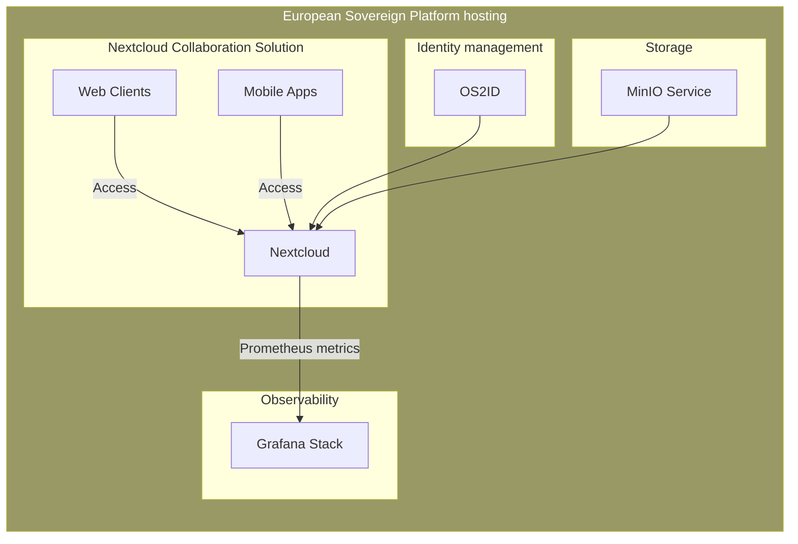

# os2LibreShare
A soverign, autonomous cloudsharing solution

## Minimum Working group requirements proposal

- Project Owner - Political liason and alignment with OS2 vision, takes part in backlog management on Epic/Story level
- OS2 Enterprise Architect - Responsible for architectural design and strategic compliance with OS2, takes part in backlog refinement on a technical level.
- Project Manager - Driving the agenada forward and controlling the suppliers, facilitating and maintaining backlog and milestones.
- Valuechain Lead - Assisting the PM in User Story collection tasks and prioritization aligned with the municipalities and schools.

#### Ad hoc members
- KL Architect - Aligning the project with the common municipal strategies 
- Infrastructure and Operations supplier - Lead
- Application suppliers - Leads

## High level solution architecture proposal

