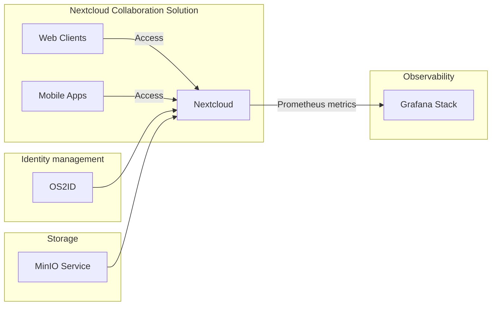

# os2LibreShare
A soverign, autonomous cloudsharing solution

## High level solution architecture proposal

```mermaid

graph LR
    subgraph "Identity management"
        F[OS2ID]
    end

    subgraph "Nextcloud Collaboration Solution"
        A[Web Clients] -->|Access| B[Nextcloud]
        C[Mobile Apps] -->|Access| B[Nextcloud]
        F-->B
    end
    subgraph "Observability"
         B[Nextcloud] -->|Prometheus metrics| D[Grafana Stack]
    end
    subgraph "Storage"
        E[MinIO Service] --> B[Nextcloud]
    end
```
